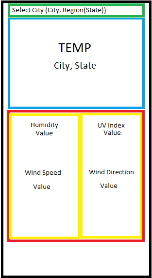
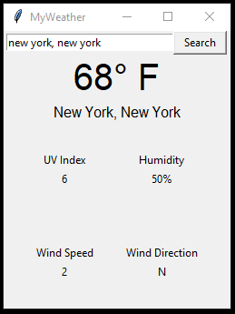

# Weather Application
<h2>Building a weather app using Weatherstack API and Tkinter</h2>

Currently working on building a weather application using python. I would also like to have a proper GUI with this application. Eventually it will all be there. 

The 'weather.json' file is essentially a cache so that I don't have to keep using up API requests to test the build.

The 'weather.py' file is my main file with the api requests. It checks if the 'weather.json' file has information from the current city in the query.
If the requested city is in the json file and the file hasn't been updated for an hour, it will not send an API request to weatherstack. Instead it will use the existing data in the json file.

<h3>Plans:</h3>
<h4>Available Info</h4>
<li>Display current temperature</li>
<li>Display current wind and direction</li>
<li>Display current humidity</li>
<li>Display current UV Index</li>
<li>Display city and state</li>

<h4>Expected Features</h4>
<li>Allow easy input of desired weather location</li>
<li>Allow for multiple locations to be available at once</li>

<h4>Planned Layout</h4>

<h4>Implemented Layout</h4>

